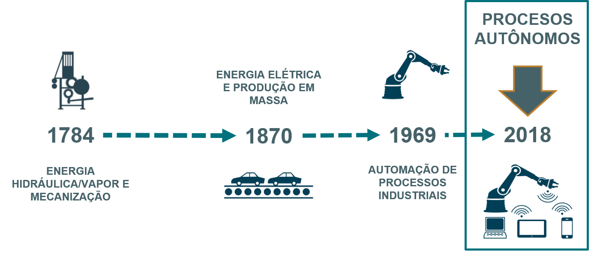
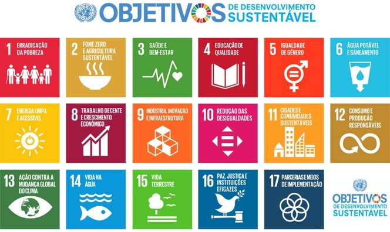
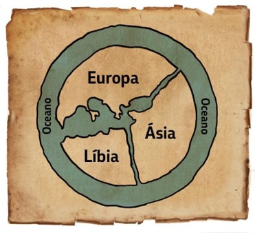
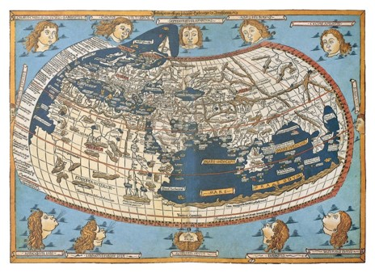

```{r setup, include=FALSE, fig.align = "center"}
options(htmltools.dir.version = FALSE)
```
class: center, middle

# SEJAM BEM VINDOS!

---
class: inverse, center, middle

# Vamos começar?

---
# Urbanização
```{r , echo=FALSE, fig.cap="A caption", out.width = '99%', fig.align = 'center'}
knitr::include_graphics('img/urbanizacao.png')
```

---
# Revoluções Industriais
Estamos imersos na 4a revolução industrial!
```{r , echo=FALSE, fig.cap="Revoluções Industriais", out.width = '99%', fig.align = 'center'}

```

---
# Novas relações econômicas

.pull-left[
```{r , echo=FALSE, out.width = '105%', fig.align = 'left'}

```
]

.pull-right[
- Economia colaborativa e consumo colaborativo   
- Redes de comunidades e individuos conectados em oposição a mercados centralizados   
- Transformações estruturais
]

---
# Objetivos de desenvolvimento sustentável
```{r , echo=FALSE, out.width = '80%', fig.align = 'center'}

```

---
# Comunicação visual

“The key to communicating visually is finding ubiquitous visual symbols that need no verbal explanation.” (Anna Vital)


---
# Representações de fenômenos e construções humanas

.pull-left[
```{r , echo=FALSE, fig.cap="Anaximandro de Mileto – IV a.C.", out.width = '105%', fig.align = 'center'}

```
]

.pull-right[
```{r , echo=FALSE,  fig.cap= "Claudio Ptolomeu – 150 d.C.", out.width = '105%', fig.align = 'center'}

```
]
---
class: inverse, middle, center

# Using xaringan

---
